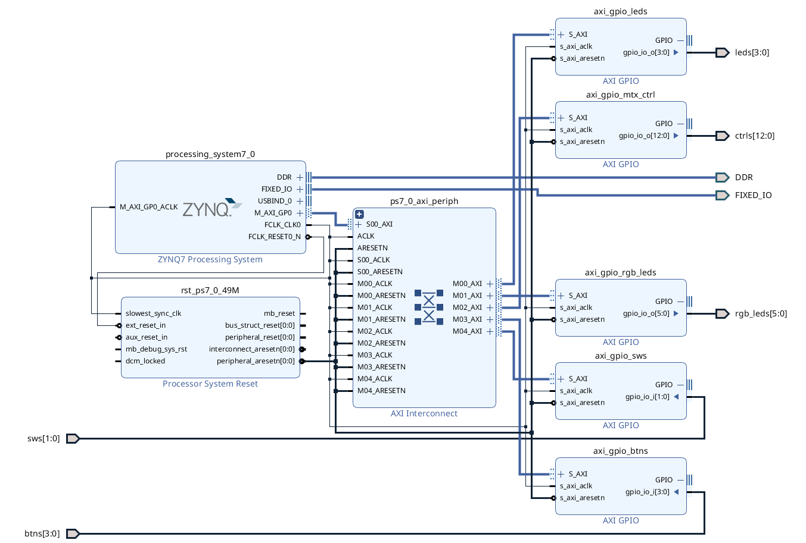

# Scrolling text

Scrolling text for PYNQ-Z1 with rgb led matrix.

Build project.

```make build_elf```

Program device.

```make program_fpga```

Execute program on device

```make run_on_device```

or to run all the above.

```make run_all```

Build libraries if necessary.

```make build_libs```

## PL diagram




